# Kế Hoạch Thực Hiện Hệ Thống Quản Lý Phòng Trọ (QLPT)

Tài liệu này mô tả chi tiết kế hoạch xây dựng phần backend bằng Java Spring Boot và PostgreSQL cho ứng dụng quản lý phòng trọ. Hệ thống hỗ trợ đăng ký tài khoản chủ trọ, quản trị viên (Admin) phê duyệt/quản lý tài khoản, tạo tài khoản cho người thuê xem thông tin phòng, tính tiền phòng theo 2 chế độ (ngày thuê hoặc ngày cố định có chia tỷ lệ theo ngày thực tế), và lưu trữ lịch sử hóa đơn bảo đảm không bị ảnh hưởng khi giá điện/nước/dịch vụ thay đổi sau này.

## Các Điểm Cần Người Dùng Xác Nhận (Review)

> [!IMPORTANT]
> **Ràng buộc về tính nhất quán dữ liệu (Data Integrity)**: Để đảm bảo hóa đơn cũ không bị thay đổi khi chủ nhà thay đổi đơn giá điện/nước hoặc giá phòng, toàn bộ thông tin giá bán tại thời điểm tạo hóa đơn (đơn giá điện, đơn giá nước, phí wifi, phí rác, giá phòng) sẽ được sao chép và lưu trữ trực tiếp (snapshot) vào bảng `Invoice` (Hóa đơn) và `InvoiceItem` (Chi tiết hóa đơn).

> [!WARNING]
> **Mô hình phân quyền (Security & Roles)**: Chúng ta sẽ cấu hình Spring Security + JWT với 3 vai trò:
> - `ROLE_ADMIN`: Quản lý các chủ trọ, phê duyệt tài khoản, xem thống kê hệ thống.
> - `ROLE_LANDLORD`: Đăng ký tài khoản, quản lý dãy trọ, phòng trọ, hợp đồng, người thuê và tạo hóa đơn hàng tháng.
> - `ROLE_TENANT`: Tài khoản do chủ trọ cấp, chỉ có quyền xem thông tin phòng đang ở, lịch sử số điện/nước và danh sách hóa đơn.

---

## Thiết Kế Cơ Sở Dữ Liệu (JPA Code-First Entities)

```mermaid
erDiagram
    ROLE {
        int id PK
        string name
    }
    USER {
        uuid id PK
        string username
        string password
        string email
        string phone
        string full_name
        string status
        uuid landlord_id FK
    }
    BOARDING_HOUSE {
        uuid id PK
        string name
        string address
        double default_electricity_rate
        double default_water_rate
        string water_billing_type
        uuid landlord_id FK
    }
    ROOM {
        uuid id PK
        string room_number
        double base_price
        double current_electricity_index
        double current_water_index
        int max_people
        string status
        uuid boarding_house_id FK
    }
    CONTRACT {
        uuid id PK
        date start_date
        date end_date
        double deposit
        double contracted_room_price
        string billing_mode
        int fixed_billing_day
        string status
        uuid room_id FK
        uuid tenant_id FK
    }
    EXTRA_FEE {
        uuid id PK
        string name
        double default_price
        string unit_type
        uuid boarding_house_id FK
    }
    CONTRACT_EXTRA_FEE {
        uuid id PK
        uuid contract_id FK
        uuid extra_fee_id FK
        double custom_price
    }
    INVOICE {
        uuid id PK
        date invoice_date
        date billing_period_start
        date billing_period_end
        double old_electricity_index
        double new_electricity_index
        double electricity_rate
        double old_water_index
        double new_water_index
        double water_rate
        double room_price
        double total_amount
        double paid_amount
        string status
        date payment_date
        uuid contract_id FK
    }
    INVOICE_ITEM {
        uuid id PK
        uuid invoice_id FK
        string name
        double price
        double quantity
        double total
    }

    USER }|--|| ROLE : has
    USER ||--o| USER : "tenant references landlord"
    BOARDING_HOUSE }|--|| USER : "owned by landlord"
    ROOM }|--|| BOARDING_HOUSE : contains
    CONTRACT ||--|| ROOM : leases
    CONTRACT ||--|| USER : "signed by tenant"
    EXTRA_FEE }|--|| BOARDING_HOUSE : configures
    CONTRACT_EXTRA_FEE }|--|| CONTRACT : applies_to
    CONTRACT_EXTRA_FEE }|--|| EXTRA_FEE : references
    INVOICE }|--|| CONTRACT : generates_for
    INVOICE_ITEM }|--|| INVOICE : contains
```

---

## Thuật Toán Tính Tiền và Chia Ngày Lẻ (Prorating)

Để giải quyết yêu cầu về 2 chế độ tính tiền:

1. **Chế độ `BY_RENTAL_DAYS` (Tính theo ngày thuê)**:
   - Kỳ thanh toán sẽ dựa trên ngày ký hợp đồng. Ví dụ: Hợp đồng ký ngày 12 thì kỳ tính tiền sẽ từ ngày 12 tháng này đến ngày 12 tháng sau.
   - Tiền phòng tính trọn vẹn theo giá hợp đồng (`contractedRoomPrice`) + tiền điện nước + phụ phí phát sinh.

2. **Chế độ `FIXED_DATE_OF_MONTH` (Tính vào ngày cố định hàng tháng)**:
   - Kỳ thanh toán kết thúc vào một ngày cố định (ví dụ: ngày 5 hàng tháng).
   - Nếu người thuê dọn vào ngày 20/05, kỳ hóa đơn đầu tiên sẽ tính từ ngày 20/05 đến ngày 05/06:
     - Số ngày ở thực tế: $D = 16$ ngày.
     - Số ngày của tháng bắt đầu tính tiền (Tháng 5 có 31 ngày): $DaysInMonth = 31$ ngày.
     - Tiền phòng lẻ sẽ được tính theo công thức:
       $$\text{Tiền phòng lẻ} = \frac{\text{contractedRoomPrice}}{31} \times 16$$
     - Các kỳ hóa đơn tiếp theo (từ ngày 05/06 đến ngày 05/07) sẽ là trọn vẹn 1 tháng và tính đủ giá `contractedRoomPrice`.

---

## Các Thay Đổi Dự Kiến Trong Mã Nguồn

Chúng ta sẽ khởi tạo cấu trúc dự án Spring Boot mới ngay trong thư mục `QLPT_JAVA_BE`.

### Cấu Hình & Khởi Tạo Dự Án

- `pom.xml`: Khai báo các dependency chính.
- `application.yml`: Cấu hình kết nối PostgreSQL và Hibernate ddl-auto.

### Cấu Trúc Gói Java (Package Structure)

- `SecurityConfig.java`: Bộ lọc JWT và phân quyền endpoints.
- **Entities Package**: Lớp thực thể JPA.
- **Repositories Package**: Interface JpaRepository.
- **Services Package**: Logic nghiệp vụ (Auth, Room, Contract, Invoice).
- **Controllers Package**: API RESTful.
